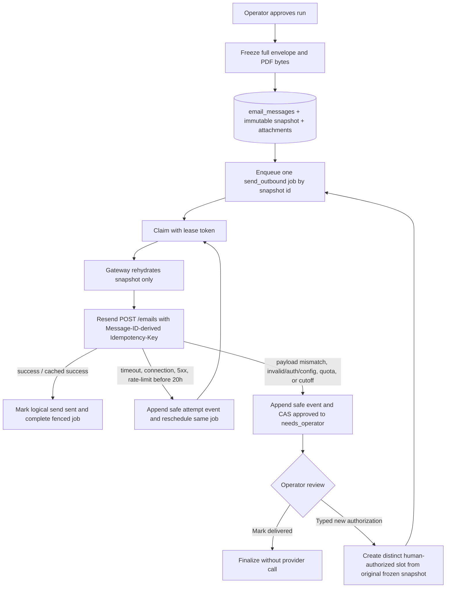

# Phase 20: Exactly-Once Send - Research

**Researched:** 2026-07-17
**Domain:** durable, provider-idempotent outbound email delivery
**Confidence:** HIGH

<user_constraints>
## User Constraints (from CONTEXT.md)

### Locked Decisions

### Bounded automatic replay

- **D-01: Own retries automatically, not through repeated operator clicks.** The durable
  queue automatically retries a send inside the provider-safe window; an operator can
  use a `retry now` control only to advance that same durable job, never to send
  synchronously or create a second attempt.
- **D-02: Retry only classified transient provider or transport failures.** Timeouts,
  connection failures, Resend 5xx responses, and rate-limit responses are eligible.
  Validation, authorization, configuration, and payload errors stop rather than retry.
- **D-03: Cap automatic replay at 20 hours from the durable reservation timestamp.** The
  reservation's database timestamp is authoritative. It is deliberately four hours
  below Resend's confirmed 24-hour retention window and is never reset by a restart,
  later failure, or manual retry.
- **D-04: Replay only the frozen provider-ready snapshot.** Once reserved, a retry may
  not redraft, reload current payroll data, regenerate PDFs, or otherwise rebuild the
  outgoing content. Later edits can affect only a separately human-authorized future
  send.
- **D-05: Keep the run `approved` while a safe retry is outstanding.** Existing
  secondary queue presentation shows `Retry queued`; do not add a payroll status or set
  `error` while automatic retry remains eligible.
- **D-06: An idempotency payload-mismatch rejection stops immediately.** Keep the
  original reservation and escalate; never automatically mint a new Message-ID or key.
- **D-07: Preserve a PII-safe attempt history beside the single logical send.** A
  successful replay finishes as sent, but the preceding uncertainty remains auditable.
  Restart recovery resumes the persisted reservation and schedule. Scheduled and
  operator-accelerated retries converge on one fenced queue job, so at most one attempt
  is active for a reservation.

### Human delivery review

- **D-08: Expired or otherwise non-replayable ambiguity enters `needs_operator` as a
  delivery-review state.** It must not look like an ordinary transient error and must
  never remain silently `approved`.
- **D-09: Give the operator two explicit outcomes.** `Mark delivered` completes the
  run without another email. `Authorize a new confirmation` creates a clearly distinct,
  human-authorized send slot only after a typed acknowledgement that it may create a
  second email.
- **D-10: Show the basis for the human decision without raw provider dumps.** The
  delivery-review card shows recipient, subject, reservation time, attempt count, safe
  failure category, Message-ID/key, and the exact frozen email/PDFs. Raw provider
  requests and responses are not rendered.
- **D-11: A human-authorized new confirmation reuses the original frozen snapshot.** It
  produces the same content and attachments under a distinct, explicitly authorized
  send slot; it does not silently use changed payroll or contact data.

### Immutable record

- **D-12: Freeze the full provider-ready envelope atomically with reservation before
  any provider call.** It includes sender, recipient, reply-to, headers, subject, text,
  attachment filenames, and exact attachment bytes.
- **D-13: Keep the snapshot append-only.** State transitions and PII-safe attempt events
  are separate from snapshot content; a retry never overwrites it. Retain completed and
  manually resolved snapshots in the existing append-only email audit—Phase 20 adds no
  purge rule.

### Folded Todos

The user explicitly selected all three pending polish todos when the phase matcher
presented them. They are secondary to SEND-01 through SEND-03 and must never delay or
weaken the delivery-safety path.

- **Frontend progressive enhancement** (`.planning/todos/pending/260623-02-frontend-progressive-enhancement.md`)
  — fold only any small progressive enhancement naturally needed to make delivery review
  legible; do not expand Phase 20 into a frontend redesign.
- **Paystub YTD columns** (`.planning/todos/pending/260623-03-paystub-ytd-v2.md`) — keep
  visible as a user-selected item, but do not alter the immutable replay contract or
  regenerate an already-reserved PDF.
- **Eval chart restyle** (`.planning/todos/pending/260623-04-eval-chart-restyle-v2.md`) —
  may be planned only as non-blocking polish after the SEND requirements; it is unrelated
  to the outbound-send correctness gate.

### the agent's Discretion

- Confirm Resend's current SDK mechanism and documented idempotency-window semantics
  before setting the concrete retry ladder and response classification.
- Choose the schema, repository, and queue-handler boundaries that preserve the frozen
  snapshot and one-fenced-job invariant.
- Choose the exact wording, routing, and styling of the delivery-review card and typed
  acknowledgement, provided the two explicit outcomes and safe-data boundary hold.
- Choose compact, PII-safe attempt-history fields and how the existing queue badge is
  connected to delivery retry work.

### Deferred Ideas (OUT OF SCOPE)

None — discussion stayed within the Phase 20 delivery-safety boundary. The three
user-selected polish todos are captured above as secondary folded items.
</user_constraints>

<phase_requirements>
## Phase Requirements

| ID | Description | Research Support |
|----|-------------|------------------|
| SEND-01 | Retry reuses the reserved Message-ID; the outbound upsert must not overwrite it. | Read-or-reserve repository API, immutable conflict rule, Message-ID-derived provider key, and real-Postgres snapshot tests. [VERIFIED: codebase] |
| SEND-02 | Retry replays persisted subject/body/recipient/PDF bytes without LLM drafting or PDF regeneration. | Atomic provider-ready snapshot plus attachment-byte child records; send handler rehydrates only by snapshot identifier. [VERIFIED: codebase] |
| SEND-03 | Every provider send has Resend's idempotency option; retries remain inside its retention window and stale ambiguity escalates. | Resend's 24-hour documented cache, 20-hour application cutoff, explicit response classification, durable queued retry, and delivery-review routes. [CITED: https://resend.com/docs/dashboard/emails/idempotency-keys] |
</phase_requirements>

## Summary

The correct Phase 20 boundary is a durable **read-or-reserve snapshot** followed by an
identifier-only, fenced `send_outbound` job. The current gateway instead mints a UUID
before checking for a row, and `insert_email_message()` then overwrites `message_id`,
`subject`, and `body_text` on the send-slot conflict. The current delivery path composes
with an LLM and regenerates ReportLab PDFs before calling the gateway. Those three facts
make a retry unsafe today. [VERIFIED: codebase]

Resend provides the necessary bounded provider primitive: `POST /emails` accepts an
`Idempotency-Key`, keeps it for 24 hours, and returns the original result for a matching
repeat. A reused key with a different payload returns
`409 invalid_idempotent_request`; a concurrent same-key request returns
`409 concurrent_idempotent_requests` and may be retried later. [CITED: https://resend.com/docs/dashboard/emails/idempotency-keys]

**Primary recommendation:** reserve the complete immutable envelope and attachment bytes
in one database transaction, enqueue exactly one `send_outbound` job keyed by that
reservation, and let its handler call Resend with the reservation's existing
Message-ID as `idempotency_key`; retry only the locked transient classes until the
reservation is 20 hours old. [VERIFIED: codebase]

## Architectural Responsibility Map

| Capability | Primary Tier | Secondary Tier | Rationale |
|------------|--------------|----------------|-----------|
| Freeze/read provider-ready snapshot | Database / Storage | API / Backend | Atomic persistence makes the envelope durable before the external side effect. [VERIFIED: codebase] |
| Provider send and classification | API / Backend | External Resend API | The gateway owns provider details; business content must not be recomputed at this seam. [VERIFIED: codebase] |
| Retry scheduling, leasing, and fencing | Database / Storage | API / Backend | Existing `jobs` claim/settlement owns durable transport state and prevents zombie writes. [VERIFIED: codebase] |
| Delivery review and typed authorization | API / Backend | Server-rendered browser | The route validates the acknowledgement and exposes only a bounded safe projection. [VERIFIED: codebase] |

## Standard Stack

### Core

| Library / component | Version | Purpose | Why standard here |
|---------------------|---------|---------|-------------------|
| `resend` | 2.32.2 | Provider send with SDK `SendOptions.idempotency_key`. | The locked project dependency exposes the exact option and emits the `Idempotency-Key` request header. [VERIFIED: codebase] |
| PostgreSQL + psycopg | existing locked stack | Reservation, immutable audit, queue claim, and fenced settlement. | Existing schema/repository conventions provide caller-owned transactions and `FOR UPDATE SKIP LOCKED`; no provider call belongs inside a transaction. [VERIFIED: codebase] |
| Existing queue (`jobs`) | existing app component | Durable retry, `available_at`, claim-attempt accounting, lease fencing. | It already accepts identifier-only contexts and labels delayed jobs `Retry queued`. [VERIFIED: codebase] |
| FastAPI + Jinja2 | existing locked stack | Delivery-review POST actions and run-detail card. | The project already has router/template safe-projection conventions; no SPA is warranted. [VERIFIED: codebase] |

### Supporting

| Component | Purpose | When to use |
|-----------|---------|-------------|
| `PipelineResult` and bounded `PipelineReason` | Carry safe retryable/terminal outcomes through queue settlement. | Add delivery-specific classified outcomes without retaining raw Resend errors. [VERIFIED: codebase] |
| Existing `email_messages` audit | Logical send-slot identity and RFC reply anchor. | Preserve as the append-only logical-send record; do not overwrite content on retry. [VERIFIED: codebase] |

### Alternatives Considered

| Instead of | Could Use | Tradeoff |
|------------|-----------|----------|
| Persisted bytes | Recompose/re-render on retry | Recomposition permits LLM/contact drift and ReportLab bytes are not stable, producing a Resend payload-mismatch error or a changed email. [VERIFIED: codebase] |
| Resend API idempotency | Local `sent` flag alone | A process can fail after Resend accepts and before the local `sent` update; local state alone cannot decide whether to resend. [VERIFIED: codebase] |
| Fenced durable job | Route-owned synchronous retry / repeated clicks | It breaks restart recovery and can overlap an automatic attempt. Existing queue fencing solves this transport concern. [VERIFIED: codebase] |

**Installation:** none. Phase 20 adds no dependencies. [VERIFIED: codebase]

## Package Legitimacy Audit

No package installation is in scope. `resend==2.32.2` is already pinned in
`pyproject.toml` and `uv.lock`; Phase 20 must not use `pip`, add a dependency, or create
a requirements file. [VERIFIED: codebase]

## Architecture Patterns

### System Architecture Diagram



### Pattern 1: Read-or-reserve immutable outbound snapshot

**What:** replace the current blind outbound upsert with a repository operation that first
locks/loads the row for `(run_id, purpose, round, epoch)` and returns it unchanged when
it already exists. Only the absent-row branch creates the RFC Message-ID and stores all
provider fields plus exact attachment bytes in the same transaction. [VERIFIED: codebase]

**When to use:** every `gateway.send_outbound` caller, including clarification sends; the
shared primitive must not leave a backdoor to the old mint-and-overwrite path. [VERIFIED: codebase]

**Required snapshot fields:** logical email id, Message-ID/idempotency key, sender,
recipient(s), reply-to, in-reply-to/references, headers, subject, text, attachment
ordinal/filename/content bytes, reservation timestamp, and provider message id once
known. Do not use JSON serialization that can re-encode attachment bytes. [VERIFIED: codebase]

### Pattern 2: Identifier-only send job with fenced settlement

**What:** add a `send_outbound` `JobKind` whose only business context is the immutable
outbound email/snapshot UUID already supported by `jobs.email_id`; update the enum, SQL
CHECK constraints, enqueue validation, dispatch table, `Job` mapping, fake repository,
and drift tests together. [VERIFIED: codebase]

**When to use:** initial delivery, worker-reclaim, cron/pump retry, and `retry now` all
target the same job/dedup key derived from the snapshot UUID. A losing lease token must
not append another event, reschedule, or move the run to review. [VERIFIED: codebase]

### Pattern 3: Bounded retry policy from reservation time

**What:** calculate eligibility from database `reserved_at`, not from `updated_at`, job
attempts, page time, or a newly created retry. Keep the existing queue's per-attempt
lease fencing, but give the send job a delivery-specific schedule that never places its
next attempt at or after `reserved_at + 20 hours`. [VERIFIED: codebase]

**Concrete ladder:** attempt immediately, then schedule at reservation age 1 minute,
5 minutes, 15 minutes, 1 hour, 3 hours, 8 hours, and 16 hours. If a claim occurs at or
after 20 hours, or the next scheduled attempt would be at/after 20 hours, stop and
escalate. This keeps the final automatic send four hours inside Resend's 24-hour key
retention window. [CITED: https://resend.com/docs/dashboard/emails/idempotency-keys]

### Pattern 4: Explicit human review, not a generic error/retrigger

**What:** on a non-replayable result, atomically record a bounded delivery-review event
and transition `approved -> needs_operator`. Show a safe run-detail card with the frozen
artifact and exactly two POST actions. `Mark delivered` finalizes without Resend;
`Authorize a new confirmation` requires an exact typed acknowledgement, clones only the
original persisted snapshot into a distinct, human-authorized epoch/send slot, then
enqueues its single job after commit. [VERIFIED: codebase]

**Why a new epoch:** the existing unique send-slot key includes `epoch`, and existing
human retrigger already uses `clear_reply_context()` to create a new epoch. Reusing that
human-only discriminator preserves one logical send per slot while making the new
authorization explicit and auditable. The implementation must copy the frozen snapshot,
not call `deliver()`'s composition path. [VERIFIED: codebase]

### Anti-Patterns to Avoid

- **Updating a reserved row from the caller's arguments:** it reintroduces the current
  Message-ID/content overwrite defect. [VERIFIED: codebase]
- **Passing generated PDF bytes through a job payload:** job rows are identifiers-only
  transport records and this would duplicate sensitive PII-bearing content. [VERIFIED: codebase]
- **Any automatic replacement key after 409 payload mismatch:** Resend documents that
  a changed payload under the same key is a failed idempotent request; a new key would
  authorize a second provider email without a human decision. [CITED: https://resend.com/docs/dashboard/emails/idempotency-keys]
- **Treating every 429 as transient:** Resend distinguishes retryable rate-limit pressure
  from daily/monthly quota exhaustion; classify by bounded provider code, not status
  alone. [CITED: https://resend.com/docs/api-reference/errors]
- **Moving the run to `error` while retry is owed:** it contradicts the locked
  `approved`-while-retrying state and conflates business state with queue transport. [VERIFIED: codebase]

## Don't Hand-Roll

| Problem | Do not build | Use instead | Why |
|---------|--------------|-------------|-----|
| Provider duplicate suppression | A local boolean or custom HTTP-header shim | Resend's documented `Idempotency-Key` option. | The provider returns the cached original result for matching repeats within 24 hours. [CITED: https://resend.com/docs/dashboard/emails/idempotency-keys] |
| Retry ownership | Browser loop, `BackgroundTasks`, or an in-memory timer | Existing durable queue/pump and lease fencing. | Render restarts/sleep make process memory non-durable. [VERIFIED: codebase] |
| PII-safe diagnostics | Raw Resend error/response rendering | Existing bounded `PipelineResult` reason codes and safe projections. | Current queue and run routes already keep raw exception text out of the browser. [VERIFIED: codebase] |

## Common Pitfalls

### Pitfall 1: The first write mutates the retry record
**What goes wrong:** retry code calls the existing upsert with newly minted arguments.
**Why:** its conflict clause currently replaces the Message-ID, subject, body, and
`created_at`. [VERIFIED: codebase]
**How to avoid:** split reservation/load from state transition; immutable columns never
appear in `DO UPDATE`. Test the actual SQL and live row bytes. [VERIFIED: codebase]

### Pitfall 2: PDF/LLM drift turns idempotency into a 409
**What goes wrong:** retry calls `deliver()` and recomposes text or rebuilds ReportLab PDFs.
**Why:** the current delivery path invokes both before the gateway, while Resend rejects a
same key with a different normalized payload. [VERIFIED: codebase] [CITED: https://resend.com/docs/dashboard/emails/idempotency-keys]
**How to avoid:** the handler receives only `email_id`, reads stored bytes, and has no
imports/calls to compose or PDF generation. [VERIFIED: codebase]

### Pitfall 3: Attempt cap bypasses the time guarantee
**What goes wrong:** the generic queue default is five attempts with a maximum five-minute
backoff, so it cannot implement the required 20-hour retry policy. [VERIFIED: codebase]
**How to avoid:** make a per-send schedule and `max_attempts` explicit, and make the
reservation-time cutoff win over both the ladder and generic dead-letter behavior. [VERIFIED: codebase]

### Pitfall 4: Retrying permanent 429s or 4xxs
**What goes wrong:** all 429s are treated as rate limiting, or any provider exception is
replayed. [CITED: https://resend.com/docs/api-reference/errors]
**How to avoid:** retry only connection/timeout, Resend 5xx, and `rate_limit_exceeded`;
escalate quota, validation, authentication, authorization, configuration, invalid key,
and idempotency payload mismatch. [CITED: https://resend.com/docs/api-reference/errors]

### Pitfall 5: Manual "retry now" bypasses the queue
**What goes wrong:** a route calls Resend synchronously while a leased worker exists.
**Why:** it defeats the one-active-attempt and fence invariant. [VERIFIED: codebase]
**How to avoid:** route only makes the existing due job immediately available through a
fenced/repository operation and wakes after commit. [VERIFIED: codebase]

## Code Examples

### Provider call from an immutable snapshot

```python
# Source: existing resend==2.32.2 SDK + official Resend idempotency documentation
snapshot = repo.load_outbound_snapshot(email_id)  # immutable stored envelope
response = resend.Emails.send(
    snapshot.to_send_params(),
    {"idempotency_key": snapshot.message_id},
)
```

The installed SDK declares `Emails.SendOptions.idempotency_key`, and its request layer
emits that value as the `Idempotency-Key` header. [VERIFIED: codebase]

### Reservation-time eligibility

```python
# The database reservation timestamp, not process time, is authoritative.
if now >= snapshot.reserved_at + timedelta(hours=20):
    return DeliveryOutcome.needs_operator("retry_window_expired")
if result.is_transient_resend_failure:
    return DeliveryOutcome.retry_at(next_ladder_time(snapshot.reserved_at, attempt))
return DeliveryOutcome.needs_operator(result.safe_reason)
```

The 20-hour application cutoff is deliberately narrower than Resend's documented
24-hour retention window. [CITED: https://resend.com/docs/dashboard/emails/idempotency-keys]

## State of the Art

| Old approach | Current Phase 20 approach | Impact |
|--------------|---------------------------|--------|
| Fail closed on every possible send | Reuse the same frozen payload/key for classified transient faults within a bounded window. | A timeout after provider acceptance is replay-safe only while Resend retains the key. [CITED: https://resend.com/docs/dashboard/emails/idempotency-keys] |
| Synchronous approval-time delivery | Approval creates durable intent; a queued handler owns side effects and recovery. | Restarts and delayed retries remain auditable and fenced. [VERIFIED: codebase] |

## Assumptions Log

| # | Claim | Section | Risk if Wrong |
|---|-------|---------|---------------|
| A1 | None. | — | All external-provider facts used for the delivery contract were checked against current official Resend documentation. |

## Open Questions

1. **How should the immutable snapshot be represented physically?**
   - What we know: `email_messages` already holds the logical send identity and core text
     fields, but no reply-to/header snapshot or attachment bytes. [VERIFIED: codebase]
   - Recommendation: keep `email_messages` as the logical audit row, add immutable
     snapshot fields and a one-to-many `outbound_email_attachments` table keyed by email
     row UUID; insert both in the reservation transaction. This avoids JSON/base64 byte
     drift and preserves attachment order. [VERIFIED: codebase]

2. **What exact repository operation accelerates `retry now`?**
   - What we know: existing `enqueue_job` limits arbitrary delay to 300 seconds and the
     normal `fail_job` path owns retries. [VERIFIED: codebase]
   - Recommendation: add a narrowly scoped, fenced "make this pending send job due now"
     operation that never creates another job; test it loses harmlessly to a lease owner.
     [VERIFIED: codebase]

## Environment Availability

| Dependency | Required By | Available | Version / state | Fallback |
|------------|-------------|-----------|-----------------|----------|
| `uv` | Python test and lint commands | Yes | 0.9.9 | None; project policy requires `uv`. [VERIFIED: local environment] |
| Resend SDK | Gateway idempotency option | Yes | 2.32.2, locked and installed | None; do not add another mail client. [VERIFIED: codebase] |
| Live Postgres | integration/fencing proof | No | `DATABASE_URL` and `ALLOW_DB_RESET` unset | hermetic tests now; Phase 21 real-Postgres CI proof remains required. [VERIFIED: local environment] |
| Live Resend credentials | live provider verification | No | `RESEND_API_KEY` unset | mocked SDK tests; no live email during Phase 20 tests. [VERIFIED: local environment] |

**Missing dependencies with no fallback:** none for implementation; live provider and
database checks require their CI/deployment environment. [VERIFIED: local environment]

## Validation Architecture

### Test Framework

| Property | Value |
|----------|-------|
| Framework | pytest, configured in `pyproject.toml`. [VERIFIED: codebase] |
| Config file | `pyproject.toml` (`integration` and `queueproof` markers). [VERIFIED: codebase] |
| Quick run command | `uv run pytest -q tests/test_send_idempotency.py tests/test_delivery.py tests/test_gateway.py` |
| Full suite command | `uv run pytest -q` |

### Phase Requirements -> Test Map

| Req ID | Behavior | Test Type | Automated Command | File Exists? |
|--------|----------|-----------|-------------------|-------------|
| SEND-01 | Repeated send-slot reservation returns byte-identical Message-ID; conflict cannot mutate immutable fields. | Hermetic SQL + integration | `uv run pytest -q tests/test_gateway.py tests/test_send_idempotency.py` | Existing files need extension. [VERIFIED: codebase] |
| SEND-02 | Failure then replay invokes neither LLM composition nor PDF generation and sends exact stored attachment bytes. | Hermetic unit | `uv run pytest -q tests/test_delivery.py tests/test_gateway.py` | Existing files need extension. [VERIFIED: codebase] |
| SEND-03 | Gateway supplies SDK option; transient classification schedules one bounded job; 20h cutoff/mismatch go to review. | Unit + integration | `uv run pytest -q tests/test_gateway.py tests/test_queue_durability.py tests/test_send_idempotency.py` | Existing files need extension. [VERIFIED: codebase] |

### Sampling Rate

- **Per task commit:** `uv run pytest -q tests/test_send_idempotency.py tests/test_delivery.py tests/test_gateway.py`
- **Per wave merge:** `uv run pytest -q`
- **Phase gate:** full suite green, schema drift tests green, and a no-live-provider test
  assertion before `$gsd-verify-work`. [VERIFIED: codebase]

### Wave 0 Gaps

- [ ] Extend `tests/test_gateway.py` to assert the SDK second argument/header and
  byte-identical rehydrated send params.
- [ ] Add/extend a send-job handler test that proves `compose_confirmation` and
  `generate_paystub_pdf` are not reachable on replay.
- [ ] Extend `tests/test_send_idempotency.py` with reservation age boundaries,
  immutable-upsert SQL, concurrent/fenced job behavior, and the non-vacuity twin.
- [ ] Extend fake-repo and job-kind drift inventories with the new identifier-only kind.
- [ ] Add real-Postgres coverage to the existing `queueproof` pathway; Phase 21 owns the
  milestone-wide proof/CI registration, but Phase 20 must leave its state falsifiable.

## Security Domain

### Applicable ASVS Categories

| ASVS Category | Applies | Standard Control |
|---------------|---------|------------------|
| V2 Authentication | Yes | Preserve existing authenticated internal pump and do not expose raw provider controls publicly. [VERIFIED: codebase] |
| V3 Session Management | No | The project intentionally has no operator-auth/session feature in this milestone. [VERIFIED: codebase] |
| V4 Access Control | Yes | Only a server route may accept the typed new-send authorization; it must use a CAS from `needs_operator`. [VERIFIED: codebase] |
| V5 Input Validation | Yes | Validate UUID path values, exact acknowledgement value, and bounded action enum; never use form text as provider payload. [VERIFIED: codebase] |
| V6 Cryptography | No new primitive | Reuse TLS/provider API key handling; do not invent encryption or hashes as an idempotency substitute. [VERIFIED: codebase] |

### Known Threat Patterns

| Pattern | STRIDE | Standard Mitigation |
|---------|--------|---------------------|
| Duplicate provider send after timeout | Repudiation / Tampering | Persist-before-send snapshot, fixed key, bounded replay, and human escalation after cutoff. [CITED: https://resend.com/docs/dashboard/emails/idempotency-keys] |
| Payload mismatch used to bypass dedup | Tampering | Treat `invalid_idempotent_request` as terminal review; never mint an automatic replacement key. [CITED: https://resend.com/docs/dashboard/emails/idempotency-keys] |
| Raw Resend errors shown in browser | Information disclosure | Store/render bounded category only; preserve raw diagnostics outside browser projections. [VERIFIED: codebase] |
| Parallel route/worker attempts | Tampering | One deduped job plus lease-token-fenced settlement; `retry now` only advances it. [VERIFIED: codebase] |
| Typed form bypass creates duplicate | Elevation of privilege | Exact acknowledgement + transactional CAS + explicit new epoch audit event. [VERIFIED: codebase] |

## Sources

### Primary (HIGH confidence)

- [Resend idempotency keys](https://resend.com/docs/dashboard/emails/idempotency-keys) - 24-hour retention, same-key response reuse, payload mismatch, and concurrent request behavior.
- [Resend errors](https://resend.com/docs/api-reference/errors) - validation/auth/quota/rate-limit/5xx error distinctions.
- [Resend usage limits](https://resend.com/docs/api-reference/rate-limit) - `429` rate limits and `retry-after` response header.
- Current code: `app/email/gateway.py`, `app/db/repo/emails.py`, `app/pipeline/delivery.py`, `app/pipeline/send_guard.py`, `app/db/schema.sql`, queue modules, and existing delivery/idempotency tests. [VERIFIED: codebase]

### Secondary (MEDIUM confidence)

- [Resend send-email API](https://resend.com/docs/api-reference/emails/send-email) - `Idempotency-Key` request header and expiry summary.

## Metadata

**Confidence breakdown:**
- Standard stack: HIGH - all components are installed/current project code; no dependency decision is needed. [VERIFIED: codebase]
- Architecture: HIGH - derived from locked context plus current queue/schema seams. [VERIFIED: codebase]
- Pitfalls: HIGH - central defects are directly present in current gateway/delivery code and provider behavior is official. [VERIFIED: codebase] [CITED: https://resend.com/docs/dashboard/emails/idempotency-keys]

**Research date:** 2026-07-17
**Valid until:** 2026-08-16 for project-code findings; recheck Resend documentation before a later deployment.

## Research Complete

Status: ready for planning. The plan should sequence immutable reservation/snapshot and
provider replay first, then durable retry/review routes, then falsifiable tests. [VERIFIED: codebase]
