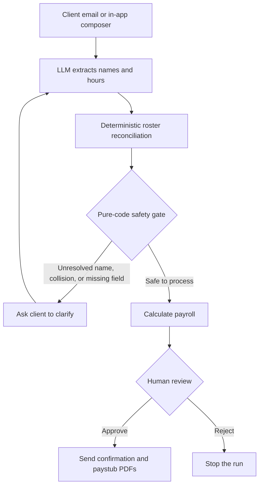

# Payroll Agent

[](https://github.com/pjnhek/payroll_agent/actions/workflows/ci.yml)

An email-driven payroll workflow that turns messy submitted hours into a calculated payroll run,
pauses for one human approval, and sends the result back to the client.

The central design choice is simple: the LLM reads the email, but deterministic code owns employee
resolution and the process-or-clarify decision. Unresolved names, alias collisions, and missing
required fields cannot silently advance to payroll calculation.

**[Open the live demo](https://payroll-agent.onrender.com/)** ·
**[Watch the walkthrough](https://www.loom.com/share/b844c3e0a3364a91b114ab892cc41db4)**

> [!WARNING]
> **Educational portfolio project — not tax-compliant payroll software.** The calculation engine
> intentionally excludes some tax provisions and should not be used to pay real employees.

## How it works



The production path also verifies the Resend webhook signature, deduplicates inbound messages by
RFC `Message-ID`, persists workflow state in Postgres, and resumes clarifications from the email
thread. See the [detailed architecture diagram](docs/architecture.svg) for the implementation-level
flow.

## Demo story

The walkthrough uses the deployed application and its in-app composer—no email client is required:

1. **Clean run:** submitted hours resolve against the roster, payroll is calculated, and the run
   waits for operator approval.
2. **Unknown name:** `David Reyez` does not match the roster, so deterministic code pauses the run.
   The LLM may suggest `David Reyes` in the clarification email, but it cannot resolve the name or
   advance payroll.
3. **Learning loop:** after the client clarifies the name and the operator approves delivery, the
   confirmed alias is stored only if a final collision check says it is safe. The same alias can
   then resolve deterministically on a later run.

The separate collision fixture uses `D. Reyes`, an alias shared by David Reyes and Daniel Reyes.
That case always clarifies rather than guessing between two employees.

The Render service may need roughly 30–60 seconds to wake after inactivity. The recording is the
most reliable way to see the complete flow without waiting for a cold start.

## Evidence

The committed eval snapshot exercises extraction, reconciliation, and deterministic decisioning
over labeled fixtures:

| Metric | Committed snapshot |
|---|---:|
| Decision fixtures | 18 |
| Process / clarify outcomes | 8 / 10 |
| False-process decisions | 0 |
| Extraction field accuracy | 99.1% |
| Extraction F1 | 98.9% |

These results describe the committed fixture suite generated on June 28, 2026—not production
traffic or a guarantee about every possible email. In particular, zero false-process decisions
show that the deterministic gate behaved correctly on those labeled cases.

[View the full eval chart](eval/chart.svg) · [Inspect the snapshot data](eval/summary.json)

## Engineering decisions

- **Code-owned decisioning:** each submitted name resolves as `exact`, `alias`, or `none`.
  `decide.py` branches only on those resolution facts and validation results—never a model score.
- **Narrow LLM boundary:** models extract structured fields, draft emails, and optionally suggest a
  likely employee in clarification copy. Extracted hours still influence calculation, which is why
  the operator reviews the computed result before delivery.
- **One operator gate:** normal runs pause at `awaiting_approval`; approval is claimed with a
  compare-and-set transition before delivery. Client clarification is a separate input, not a
  second operator approval.
- **Durable workflow state:** Supabase Postgres stores runs, messages, decisions, paystub line
  items, and clarification context. The application uses direct psycopg transactions and row-level
  state transitions rather than an autonomous agent framework.
- **Retry-safe boundaries:** inbound `Message-ID` deduplication and selected compare-and-set
  transitions prevent duplicate work at the guarded seams. Delivery is intentionally described as
  at-least-once rather than as a blanket exactly-once guarantee.
- **Portfolio-oriented infrastructure:** the deployment uses free-tier hosting where available and
  low-cost model APIs. Actual cost depends on provider usage and current pricing.

## Technology

| Layer | Implementation |
|---|---|
| Application | FastAPI + uvicorn on Render |
| State | Supabase Postgres via psycopg3 and the Supavisor transaction pooler |
| Email | Resend inbound webhooks and outbound delivery |
| LLM calls | DeepSeek extraction + Kimi drafting/suggestions through OpenAI-compatible clients |
| Payroll output | Pure-Python calculation modules + in-memory reportlab PDFs |
| Quality gates | pytest, Ruff, and mypy `--strict` in GitHub Actions |
| Environment | Python 3.12 managed by uv |

## Local development

```bash
uv sync
cp .env.example .env
# Fill in DATABASE_URL and any provider credentials you want to exercise.
uv run uvicorn app.main:app --reload
```

The default test run is hermetic: live-database and live-model tests skip unless their explicit
two-factor opt-ins and credentials are present.

```bash
uv run pytest -q
uv run ruff check .
uv run mypy
```

## Deployment notes

1. Connect the repository to Render and create a Blueprint from `render.yaml`. After that initial
   setup, pushes can trigger deployments.
2. Configure `DATABASE_URL`, `RESEND_API_KEY`, `WEBHOOK_SIGNING_SECRET`,
   `EXTRACTION_API_KEY`, and `DRAFT_API_KEY` in Render.
3. Set `RESEND_REPLY_TO` to the inbound `.resend.app` address wired to the webhook so client replies
   return to the workflow.

The default Resend sender is `onboarding@resend.dev`, which is suitable for an account-owner demo.
Sending to arbitrary client addresses requires a verified domain and a corresponding
`RESEND_FROM_ADDR`.

### The pump: cadence, recovery, and the 750-hour budget

A GitHub Actions cron (`.github/workflows/pump.yml`) hits an authenticated `/internal/pump`
endpoint every **30 minutes**, draining any due job in the durable Postgres queue. The same
workflow also pings `/health/ready` (wakes Render, touches Supabase so the free project stays
un-paused) and `/health/schema` (fails RED on schema drift, including a manual Supabase edit
that bypasses the deploy-migrate workflow) — it is the **only** cron hitting the service.

- **Recovery latency is nominal, not an absolute bound.** A due job is nominally picked up
  within the next 30-minute cadence, plus Render cold-start and the job's own execution time.
  GitHub Actions scheduling delays can push a run later, so this is a best-effort target, not a
  strict ≤30-minute end-to-end guarantee.
- **The 750-instance-hour/month math forces 30 minutes.** Render's free tier caps usage at
  ~750 instance-hours/month and sleeps the service after 15 idle minutes. The idle duty-cycle
  arithmetic is a **baseline**, not an exact figure: `awake ≈ 15 ÷ cadence` — at a 30-minute
  cadence the idle baseline is awake ~15 of every 30 minutes (~50%, ~365 instance-hours/month),
  comfortably under 750 even accounting for the extra awake time a long-running pump request
  adds (the 15-minute idle timer restarts after the pump's own activity). A 10-minute cadence
  would push toward ~730 hours with no margin — hence 30 minutes.
- **Best-effort caveats.** GitHub Actions scheduled crons can be delayed under load, and GitHub
  auto-disables a scheduled workflow after ~60 days with no repository commit activity —
  `workflow_dispatch` is the one-click re-enable from the Actions tab. Operator Retrigger is the
  stated fallback when a run needs to move faster than the cadence allows.
- **A known recovery residual: the final-attempt strand.** Automatic lease-reclaim recovers an
  interrupted job only while it still has attempts remaining. A job whose worker dies on its
  final allowed attempt is **not** auto-reclaimed by the current claim query and waits for a
  future dead-letter transition (Phase 18) — a known, low-severity, pre-existing residual that
  never loses or duplicates a payroll (the operator can retrigger the affected run).
- **The pump's counts are a transport signal, not a payroll-success count.** The pump reports
  `claimed`/`done`/`retried`/`dead`/`fenced` counts describing queue-transport outcomes —
  `done` counts job invocations that completed without an unrecordable crash, not "N successful
  payrolls." A job success rate near 100% while `payroll_runs.status='error' > 0` is a known,
  Phase-21-scoped gap, not evidence the pipeline itself is error-free.

To reset the curated demo state between recordings:

```bash
uv run python scripts/demo_reset.py --confirm
```

## Known limitations

- This is an educational demonstration, not tax-compliant payroll software.
- The engine implements the standard 2026 Pub 15-T percentage-method path used by the demo but
  excludes qualified-tips and qualified-overtime deductions and other out-of-scope provisions.
- Additional Medicare Tax is not calculated. The application only raises an
  `additional_medicare_not_modeled` limitation flag when its configured threshold estimate is
  crossed.
- State withholding is not implemented.
- A durable Postgres job queue (lease + claim protocol) now exists, proven on the operator
  Retrigger action, and the pump cron (above) recovers a due job on that queue automatically on
  its next 30-minute cadence, with no worker threads required — without a manual re-click, except
  the documented final-attempt-strand residual (Phase 18). The primary inbound-email path still
  runs through `BackgroundTasks` today; migrating every remaining producer onto the durable queue
  is a later, in-progress step of this project's durability work.
