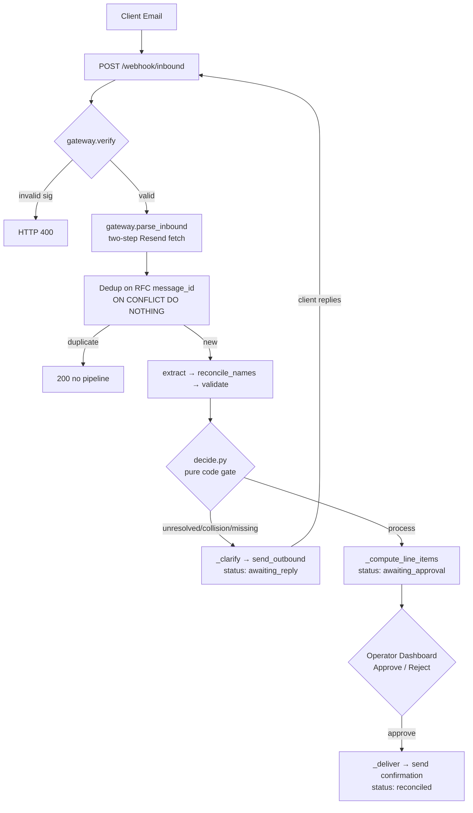
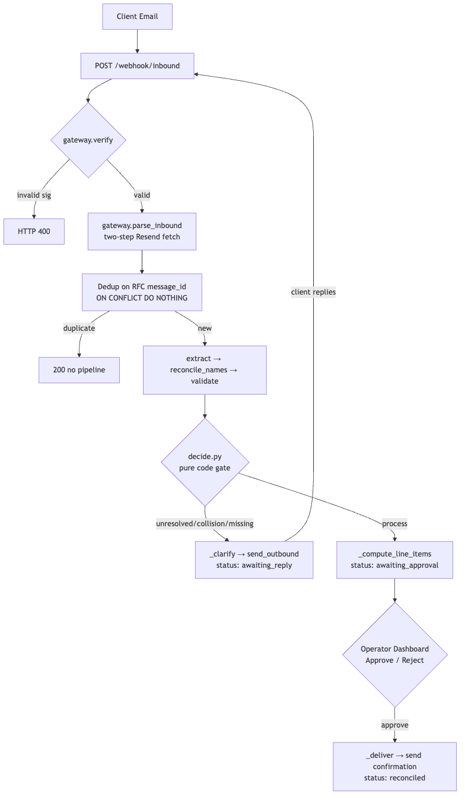
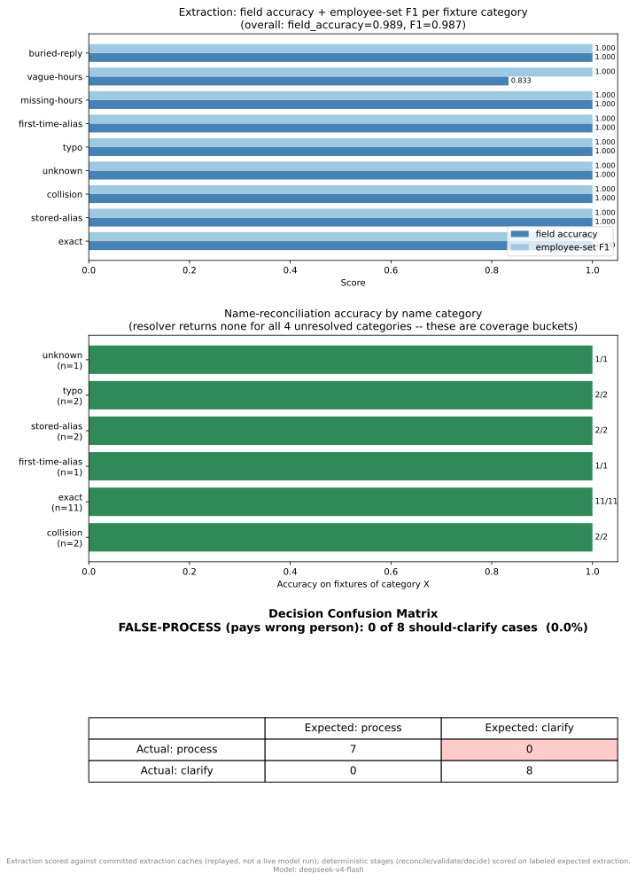

# Payroll Agent

**▶ [Live App (Live & Deployed)](https://payroll-agent.onrender.com/)**


A messy payroll email goes in; a correct, human-approved payroll comes out.
Every money-moving judgment call (name match, process-vs-clarify) is gated by
deterministic code — not a model score.

> **Educational only — not tax-compliant software.**
> This system is an educational portfolio demonstration of agentic pipeline design, not a real payroll service.
> OBBBA provisions (qualified-tips/overtime above-the-line deductions, expanded 15-line W-4) are
> explicitly excluded; the engine uses the standard Pub 15-T percentage method only.
> Additional Medicare Tax (0.9% over $200k YTD) is NOT modeled — this never triggers in demo
> wage ranges and is disclaimed here.
> **Do not use this for real payroll.**

## Architecture




*(See Mermaid diagram above for interactive version — PNG fallback for non-rendering environments)*

## Demo

**▶ [Watch the demo (Loom)](https://www.loom.com/share/b844c3e0a3364a91b114ab892cc41db4)**

The recording walks the three thesis beats on the live deployed service, driven entirely from the in-app composer (no email client needed):

1. **Clean run** — compose payroll → operator approves → confirmation sent.
2. **Unknown shorthand → clarify** — "Dave Reyes" is ambiguous (David vs Daniel Reyes), so the **code gate** requests clarification; the LLM only suggests the likely employee, it never decides.
3. **It learned** — after the operator confirms, the same shorthand resolves automatically on the next run — the alias was learned, so it stops asking.

Closing shot: the eval view with **false_process_count = 0** — no run is ever processed on a name the system couldn't resolve.

*(The Render free service may take ~30-60s to wake from sleep; the recording is the primary artifact.)*

## Eval Chart



## Key Design Choices

- **Deterministic decisioning**: `decide.py` is pure code over resolution facts — each submitted
  name resolves to `exact / stored-alias / none`; unresolved names and collisions always clarify.
  The LLM never decides. No confidence score, no guessing on a money-moving call.
- **Single operator gate**: the pipeline pauses exactly once (at `awaiting_approval`) for a human
  to review and approve the computed payroll before it reaches the client.
- **Free-stack demo**: FastAPI on Render + Supabase Postgres + Resend email — end-to-end on zero
  infrastructure cost.

---

## For Engineers

### Stack

| Layer | Tech |
|-------|------|
| Web server | FastAPI + uvicorn (Render free web service) |
| Database | Supabase Postgres via psycopg3 (pooler 6543, transaction mode) |
| Email | Resend (inbound webhook + outbound) |
| PDF | reportlab (in-memory, no disk write) |
| Package manager | uv (Python 3.12) |

### Local Setup

```bash
uv sync                    # create .venv, install all deps
cp .env.example .env       # fill in DATABASE_URL, RESEND_API_KEY, etc.
uv run uvicorn app.main:app --reload
```

### Run Tests

```bash
uv run pytest -q -m "not integration and not live_llm"
```

### Deploy

1. Push to GitHub; Render picks up `render.yaml` blueprint automatically.
2. Add these env vars in the Render dashboard:
   - `DATABASE_URL` — Supabase Supavisor pooler URL (`pooler.supabase.com:6543`, transaction mode)
   - `RESEND_API_KEY` — Resend API key
   - `WEBHOOK_SIGNING_SECRET` — Resend webhook signing secret (`whsec_...`)
   - `RESEND_REPLY_TO` — inbound `.resend.app` address (so client replies reach the webhook)
   - `EXTRACTION_API_KEY` and `DRAFT_API_KEY` — LLM API keys (DeepSeek + Kimi)

### Outbound Sender Constraint (Pass-6)

The demo runs on the Resend free tier: outbound emails are sent FROM `onboarding@resend.dev`,
which can only deliver TO the Resend account-owner email. To send to arbitrary client addresses,
verify a custom domain in the Resend Dashboard (Domains → Add Domain) and update
`RESEND_FROM_ADDR` to your verified address.

### Keep-Alive

GitHub Actions `keepalive.yml` pings the Render URL and a Supabase health endpoint 2x/week
so neither service sleeps during demo prep. Auto-disables after 60 days of no repo activity —
re-enable with `workflow_dispatch`.

### Demo Reset Between Takes

```bash
uv run python scripts/demo_reset.py --confirm
```

Clears all payroll runs + email messages, resets learned aliases via `seed()`, and
re-arms the demo identity in `demo_sender_bindings`. Requires the explicit `--confirm`
flag — the script does nothing without it. Run before every recording take so Beat 2
(unknown-shorthand Metro Deli) triggers clarification cleanly.

### Additional Medicare Tax Note

The 0.9% Additional Medicare surtax (wages over $200k single / $250k MFJ / $125k MFS)
is not modeled. At demo wage levels this never triggers; the engine sets a
`additional_medicare_not_modeled` flag on `PaystubLineItem` when the threshold would be
crossed so callers can detect the gap.
